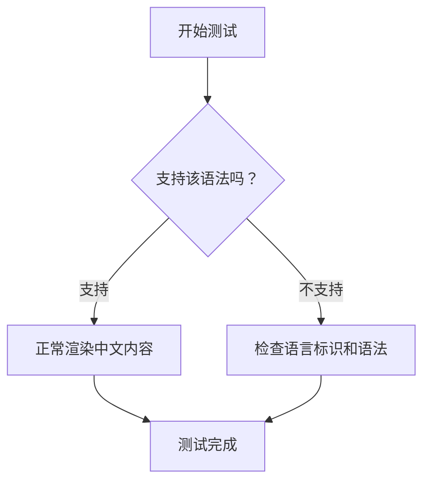
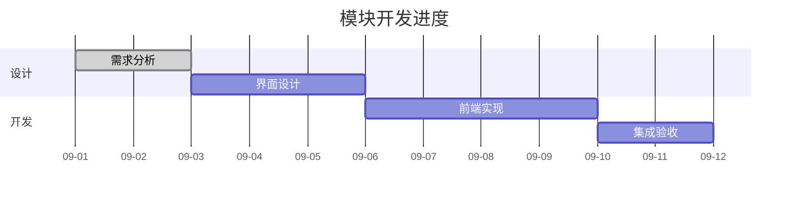
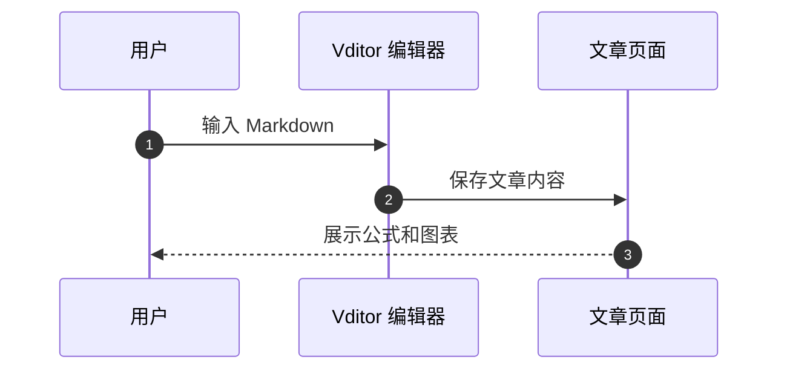
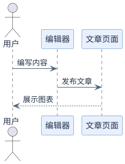

## Vditor 渲染验收

请将本文件内容粘贴到 Vditor 的 Markdown 源码模式中保存。亮色、暗色分别刷新一次，再在同一页面连续切换模式。

[跳转到代码高亮测试](#code-samples)

## 1. 数学公式

行内公式：欧拉恒等式 $e^{i\pi}+1=0$。

块级公式：

$$
f(x)=\int_{-\infty}^{\infty}\hat{f}(\xi)e^{2\pi i x\xi}\,d\xi
$$

$$
\begin{pmatrix}1 & 2\\3 & 4\end{pmatrix}
\begin{pmatrix}x\\y\end{pmatrix}
=\begin{pmatrix}x+2y\\3x+4y\end{pmatrix}
$$

## 2. 脑图

```mindmap
- Vditor 测试
  - 数学排版
    - 行内公式
    - 块级公式
  - 可视化图表
    - ECharts
    - 流程图
    - 时序图
  - 音乐排版
    - 五线谱
```

可拖动、缩放脑图。窗口缩小时留意根节点和最右侧文字。

## 3. ECharts 图表

```echarts
{
  "title": { "text": "周活跃用户趋势", "left": "center" },
  "tooltip": { "trigger": "axis" },
  "grid": { "left": 24, "right": 24, "top": 64, "bottom": 24, "containLabel": true },
  "xAxis": { "type": "category", "data": ["周一", "周二", "周三", "周四", "周五", "周六", "周日"] },
  "yAxis": { "type": "value" },
  "series": [{ "name": "活跃用户", "type": "bar", "data": [120, 200, 150, 80, 70, 110, 130] }]
}
```

这个例子没有写死背景或文字颜色，主题可以根据亮暗状态选择配色。

## 4. Mermaid 流程图



节点文字应完整，不应在右侧被裁切。

## 5. Mermaid 甘特图



宽图允许横向滚动，日期与任务文字应保持可读。

## 6. Mermaid 时序图



## 7. 五线谱

```abc
X:1
T:Twinkle Twinkle Little Star
M:4/4
L:1/4
Q:1/4=100
K:C
C C G G | A A G2 | F F E E | D D C2 |
G G F F | E E D2 | G G F F | E E D2 |
C C G G | A A G2 | F F E E | D D C2 |]
```

谱线和音符应在亮色页面使用深色、暗色页面使用浅色。

## 8. Graphviz


这里显式给出填充色和文字色；两种页面模式都使用浅色图形画布，颜色应保持一致。

## 9. PlantUML



这一项需要插件能够访问 PlantUML 的在线 SVG 服务。

## 10. 旧式 Flowchart

```flowchart
st=>start: 开始
op=>operation: 编写内容
cond=>condition: 验收通过？
e=>end: 完成
st->op->cond
cond(yes)->e
cond(no)->op
```

## 11. Markmap

```markmap
# 写作流程
## 准备
- 整理素材
- 确定结构
## 编写
- 正文
- 公式与图表
## 验收
- 亮色
- 暗色
- 手机阅读
```

<a id="code-samples"></a>

## 12. Shiki 全语言与复制

### Java

```java
public class Hello {
    public static void main(String[] args) {
        System.out.println("你好，Hanlo！");
    }
}
```

### Rust（原预置语言之外）

```rust
fn main() {
    let names = ["Hanlo", "Vditor"];
    for name in names {
        println!("Hello, {name}!");
    }
}
```

### Go（原预置语言之外）

```go
package main

import "fmt"

func main() {
    fmt.Println("你好，世界")
}
```

### XML（独立语法）

```xml
<?xml version="1.0" encoding="UTF-8"?>
<article id="demo">
    <title>Vditor 测试</title>
    <content><![CDATA[<strong>这里是源码</strong>]]></content>
</article>
```

### 使用别名 ts

```ts
interface Post {
  title: string;
  published: boolean;
}
const post: Post = { title: "渲染测试", published: true };
```

### 纯文本与图表源码

```text
graph TD
  A[这是代码示例] --> B[不要渲染为图]
```

### HTML 源码转义

```html
<script>alert("这段内容只应作为代码展示");</script>
<div class="example">示例内容</div>
```

复制以上代码应只包含源码，不包含行号、语言标题与复制按钮文案。

## 13. 多媒体

请通过 Vditor 插入你已有的 Halo 图片、音频、视频附件，检查宽度和控件。

也可以将下面的 HTML 中的地址替换为真实附件地址，再把 HTML 本身插入正文；这里保留为代码示例，避免测试文章请求不存在的附件。

```html
<video controls preload="metadata" src="https://你的站点/实际视频地址.mp4"></video>
<audio controls preload="metadata" src="https://你的站点/实际音频地址.mp3"></audio>
```

## 14. 普通排版

> 引用文字在两种模式下都应清晰。

- [x] 标题进入主题目录
- [ ] 同页亮暗切换
- [ ] 手机宽图滚动
- [ ] 代码复制与折叠

| 渲染内容 | 亮色 | 暗色 |
| --- | --- | --- |
| 公式与五线谱 | 检查 | 检查 |
| 脑图与图表 | 检查 | 检查 |
| 普通代码 | 检查 | 检查 |

## 15. 简繁转换

词组测试：头发、开发、皇后、后台。切成繁体后应看到「頭髮、開發、皇后、後臺」，再切回简体应恢复原文。

<span translate="no">这里明确保留原文：头发、开发。</span>

切换时检查上面的 PlantUML 图中「用户、编辑器、编写内容、发布文章」无需刷新整页即可变更；图像可能需要等待远程服务返回。Mermaid、ECharts、脑图和目录也应同步；第 12 节代码块与数学公式保持原文。
